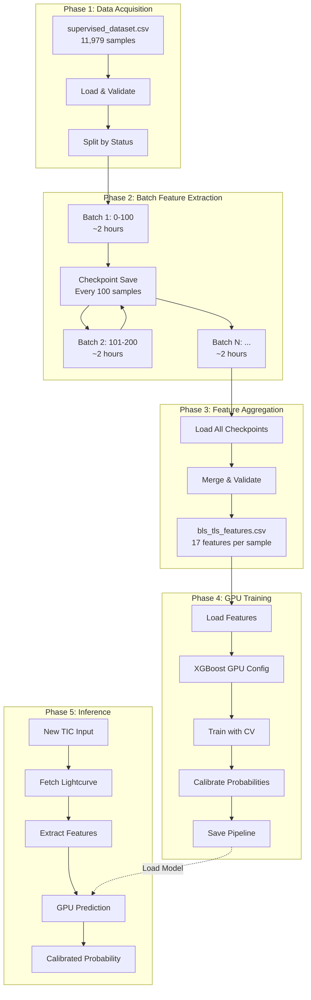

# 🏗️ Google Colab-Optimized Architecture for Exoplanet Detection System

**Project**: NASA Exoplanet Detection with BLS/TLS + XGBoost
**Target Environment**: Google Colab with GPU acceleration
**Date**: 2025-01-29
**Version**: 1.0

---

## 📊 Executive Summary

### System Scale
- **Dataset**: 11,979 samples (supervised_dataset.csv: 862KB)
- **Feature Extraction**: ~30 hours estimated for full dataset
- **Challenge**: Colab disconnects after 12 hours
- **Solution**: Checkpoint-based batch processing with automatic resume

### Performance Targets
- **Feature Extraction**: 100 samples/checkpoint (~2 hours/batch)
- **GPU Training**: <30 minutes for XGBoost
- **Inference**: <1 second per target
- **Recovery Time**: <1 minute to resume from checkpoint

---

## 🎯 Architecture Overview

```
┌─────────────────────────────────────────────────────────────────────┐
│                    GOOGLE COLAB ENVIRONMENT                          │
│                                                                       │
│  ┌────────────────────────────────────────────────────────────────┐ │
│  │              Google Drive Integration Layer                     │ │
│  │  /content/drive/MyDrive/spaceapps-exoplanet/                  │ │
│  │    ├── checkpoints/          # Incremental progress           │ │
│  │    ├── data/                 # Source datasets                │ │
│  │    ├── features/             # Extracted features             │ │
│  │    ├── models/               # Trained model artifacts        │ │
│  │    └── logs/                 # Execution logs                 │ │
│  └────────────────────────────────────────────────────────────────┘ │
│                               ↕                                      │
│  ┌────────────────────────────────────────────────────────────────┐ │
│  │          Ephemeral Processing Layer (/content)                 │ │
│  │    - Fast local storage for active processing                  │ │
│  │    - Temporary cache (cleared on disconnect)                   │ │
│  │    - 12-hour session lifecycle                                 │ │
│  └────────────────────────────────────────────────────────────────┘ │
│                               ↕                                      │
│  ┌────────────────────────────────────────────────────────────────┐ │
│  │              GPU Accelerated Processing                        │ │
│  │    - Tesla T4 (15GB VRAM) for XGBoost GPU training            │ │
│  │    - CUDA-accelerated feature extraction                       │ │
│  │    - Batch processing with memory management                   │ │
│  └────────────────────────────────────────────────────────────────┘ │
└─────────────────────────────────────────────────────────────────────┘
```

---

## 🔄 Data Pipeline Architecture

### Complete Processing Flow



---

## 🧩 Component Architecture

### 1. **Checkpoint Manager** (Critical for 12-hour Limit)

```python
"""
Location: /content/drive/MyDrive/spaceapps-exoplanet/checkpoints/

Checkpoint Structure:
{
    "checkpoint_id": "batch_0000_0100",
    "timestamp": "2025-01-29T10:30:00Z",
    "batch_range": [0, 100],
    "completed_indices": [0, 1, 2, ..., 99],
    "failed_indices": [42, 87],  # Track failures for retry
    "features": {
        "0": {feature_dict_for_sample_0},
        "1": {feature_dict_for_sample_1},
        ...
    },
    "metadata": {
        "execution_time": 7200,  # seconds
        "gpu_used": false,
        "errors": []
    }
}
"""

class CheckpointManager:
    """
    Manages incremental progress with automatic recovery
    """

    def __init__(self, drive_path: str, batch_size: int = 100):
        self.drive_path = Path(drive_path)
        self.checkpoint_dir = self.drive_path / "checkpoints"
        self.checkpoint_dir.mkdir(parents=True, exist_ok=True)
        self.batch_size = batch_size

    def save_checkpoint(
        self,
        batch_id: int,
        features: Dict[int, Dict],
        failed_indices: List[int] = None
    ) -> str:
        """Save batch progress to Drive"""
        checkpoint = {
            "checkpoint_id": f"batch_{batch_id:04d}_{batch_id + self.batch_size:04d}",
            "timestamp": datetime.utcnow().isoformat(),
            "batch_range": [batch_id, batch_id + self.batch_size],
            "completed_indices": list(features.keys()),
            "failed_indices": failed_indices or [],
            "features": features,
            "metadata": self._collect_metadata()
        }

        checkpoint_file = self.checkpoint_dir / f"{checkpoint['checkpoint_id']}.json"
        with open(checkpoint_file, 'w') as f:
            json.dump(checkpoint, f, indent=2)

        return checkpoint_file

    def load_latest_checkpoint(self) -> Optional[Dict]:
        """Resume from most recent checkpoint"""
        checkpoints = sorted(self.checkpoint_dir.glob("batch_*.json"))
        if not checkpoints:
            return None

        with open(checkpoints[-1], 'r') as f:
            return json.load(f)

    def get_completed_indices(self) -> Set[int]:
        """Get all successfully processed indices"""
        completed = set()
        for checkpoint_file in self.checkpoint_dir.glob("batch_*.json"):
            with open(checkpoint_file, 'r') as f:
                checkpoint = json.load(f)
                completed.update(checkpoint["completed_indices"])
        return completed

    def merge_all_checkpoints(self) -> pd.DataFrame:
        """Merge all checkpoint features into single DataFrame"""
        all_features = {}

        for checkpoint_file in sorted(self.checkpoint_dir.glob("batch_*.json")):
            with open(checkpoint_file, 'r') as f:
                checkpoint = json.load(f)
                all_features.update(checkpoint["features"])

        return pd.DataFrame.from_dict(all_features, orient='index')
```

### 2. **GPU-Accelerated Feature Extractor**

```python
"""
Feature Extraction with Mixed CPU/GPU Processing

CPU-Bound Operations (lightkurve, astropy):
- Lightcurve download from MAST
- BLS period search
- TLS transit fit

GPU-Accelerated Operations (CuPy, Rapids):
- Large array operations
- Statistical computations
- Parallel lightcurve preprocessing
"""

class GPUFeatureExtractor:
    """
    Intelligent GPU/CPU workload distribution
    """

    def __init__(self, use_gpu: bool = True):
        self.use_gpu = use_gpu and self._check_gpu_available()

        if self.use_gpu:
            import cupy as cp
            self.xp = cp
            print("✅ GPU acceleration enabled")
        else:
            self.xp = np
            print("⚠️ Fallback to CPU processing")

    def _check_gpu_available(self) -> bool:
        """Detect GPU availability"""
        try:
            import cupy as cp
            cp.cuda.Device(0).compute_capability
            return True
        except:
            return False

    def extract_features_batch(
        self,
        dataset: pd.DataFrame,
        batch_indices: List[int],
        checkpoint_manager: CheckpointManager
    ) -> Dict[int, Dict]:
        """
        Extract features for a batch with GPU optimization

        Returns:
            Dictionary mapping index -> feature dict
        """
        features = {}
        failed = []

        for idx in tqdm(batch_indices, desc="Feature Extraction"):
            try:
                # CPU: Download lightcurve
                row = dataset.iloc[idx]
                lc = self._download_lightcurve(row['TIC'], row.get('Sector'))

                if lc is None:
                    failed.append(idx)
                    continue

                # GPU: Preprocess (detrending, outlier removal)
                time, flux = self._preprocess_gpu(lc.time.value, lc.flux.value)

                # CPU: BLS search
                bls_result = self._run_bls(time, flux)

                # CPU: TLS fit
                tls_result = self._run_tls(time, flux, bls_result['period'])

                # GPU: Statistical features
                stats = self._compute_statistics_gpu(flux)

                # Combine features
                features[idx] = {
                    **bls_result,
                    **tls_result,
                    **stats,
                    'tic_id': row['TIC'],
                    'ground_truth': row['label']
                }

            except Exception as e:
                print(f"❌ Failed sample {idx}: {e}")
                failed.append(idx)

        return features, failed

    def _preprocess_gpu(
        self,
        time: np.ndarray,
        flux: np.ndarray
    ) -> Tuple[np.ndarray, np.ndarray]:
        """GPU-accelerated preprocessing"""
        if not self.use_gpu:
            return time, flux

        # Transfer to GPU
        flux_gpu = self.xp.asarray(flux)

        # Sigma clipping on GPU
        median = self.xp.median(flux_gpu)
        std = self.xp.std(flux_gpu)
        mask = self.xp.abs(flux_gpu - median) < 3 * std

        # Transfer back to CPU
        clean_time = time[self.xp.asnumpy(mask)]
        clean_flux = self.xp.asnumpy(flux_gpu[mask])

        return clean_time, clean_flux

    def _compute_statistics_gpu(self, flux: np.ndarray) -> Dict[str, float]:
        """GPU-accelerated statistical features"""
        flux_gpu = self.xp.asarray(flux) if self.use_gpu else flux

        stats = {
            'flux_mean': float(self.xp.mean(flux_gpu)),
            'flux_std': float(self.xp.std(flux_gpu)),
            'flux_median': float(self.xp.median(flux_gpu)),
            'flux_mad': float(self.xp.median(self.xp.abs(flux_gpu - self.xp.median(flux_gpu)))),
            'flux_skew': float(self._skewness_gpu(flux_gpu)),
            'flux_kurtosis': float(self._kurtosis_gpu(flux_gpu))
        }

        return stats
```

### 3. **XGBoost GPU Training Configuration**

```python
"""
GPU-optimized XGBoost configuration for Colab T4 (15GB VRAM)

Key Optimizations:
- tree_method='gpu_hist' for GPU acceleration
- Batch size tuning for memory efficiency
- Early stopping to prevent overfitting
- CV with GPU support
"""

class GPUXGBoostTrainer:
    """
    XGBoost trainer optimized for Colab GPU
    """

    def __init__(self):
        self.gpu_available = self._check_xgboost_gpu()

    def _check_xgboost_gpu(self) -> bool:
        """Verify XGBoost GPU support"""
        import xgboost as xgb
        try:
            # Test GPU availability
            dtrain = xgb.DMatrix(np.random.rand(10, 5))
            params = {'tree_method': 'gpu_hist', 'gpu_id': 0}
            xgb.train(params, dtrain, num_boost_round=1)
            return True
        except:
            return False

    def get_gpu_params(self) -> Dict:
        """
        GPU-optimized hyperparameters for T4

        Memory Budget:
        - T4 VRAM: 15GB
        - Feature matrix: ~200MB (11979 samples × 17 features)
        - Tree cache: ~1GB per tree
        - Safe tree limit: 1000-2000 trees
        """
        base_params = {
            # GPU Configuration
            'tree_method': 'gpu_hist' if self.gpu_available else 'hist',
            'predictor': 'gpu_predictor' if self.gpu_available else 'cpu_predictor',
            'gpu_id': 0,

            # Model Parameters
            'objective': 'binary:logistic',
            'eval_metric': ['logloss', 'auc', 'aucpr'],
            'max_depth': 6,
            'learning_rate': 0.05,
            'n_estimators': 1000,
            'subsample': 0.8,
            'colsample_bytree': 0.8,

            # Regularization
            'min_child_weight': 3,
            'gamma': 0.1,
            'reg_alpha': 0.1,
            'reg_lambda': 1.0,

            # Performance
            'n_jobs': -1,
            'random_state': 42,

            # Early Stopping
            'early_stopping_rounds': 50,
        }

        return base_params

    def train_with_cv(
        self,
        X: pd.DataFrame,
        y: pd.Series,
        n_folds: int = 5
    ) -> Tuple[object, Dict]:
        """
        Train with cross-validation on GPU

        Returns:
            Trained model and CV metrics
        """
        from sklearn.model_selection import StratifiedKFold
        from xgboost import XGBClassifier

        # Initialize model
        model = XGBClassifier(**self.get_gpu_params())

        # Stratified K-Fold
        skf = StratifiedKFold(n_splits=n_folds, shuffle=True, random_state=42)

        cv_scores = {'train_auc': [], 'val_auc': [], 'val_aucpr': []}

        for fold, (train_idx, val_idx) in enumerate(skf.split(X, y)):
            print(f"\n🔄 Training Fold {fold + 1}/{n_folds}")

            X_train, X_val = X.iloc[train_idx], X.iloc[val_idx]
            y_train, y_val = y.iloc[train_idx], y.iloc[val_idx]

            # Train with early stopping
            model.fit(
                X_train, y_train,
                eval_set=[(X_train, y_train), (X_val, y_val)],
                verbose=False
            )

            # Evaluate
            from sklearn.metrics import roc_auc_score, average_precision_score

            train_pred = model.predict_proba(X_train)[:, 1]
            val_pred = model.predict_proba(X_val)[:, 1]

            cv_scores['train_auc'].append(roc_auc_score(y_train, train_pred))
            cv_scores['val_auc'].append(roc_auc_score(y_val, val_pred))
            cv_scores['val_aucpr'].append(average_precision_score(y_val, val_pred))

        # Retrain on full dataset
        print("\n🚀 Training final model on full dataset...")
        model.fit(X, y, verbose=False)

        # Summary
        cv_summary = {
            'mean_train_auc': np.mean(cv_scores['train_auc']),
            'mean_val_auc': np.mean(cv_scores['val_auc']),
            'mean_val_aucpr': np.mean(cv_scores['val_aucpr']),
            'std_val_auc': np.std(cv_scores['val_auc']),
            'gpu_used': self.gpu_available
        }

        return model, cv_summary
```

### 4. **Session Persistence Manager**

```python
"""
Handles Colab session disconnects and automatic recovery

Key Features:
- Save session state every N minutes
- Auto-detect disconnection
- Resume from last checkpoint
- Progress tracking
"""

class SessionPersistence:
    """
    Manage session state across Colab disconnects
    """

    def __init__(self, drive_path: str):
        self.drive_path = Path(drive_path)
        self.state_file = self.drive_path / "session_state.json"
        self.last_save = None

    def save_state(self, state: Dict) -> None:
        """
        Save current execution state

        State includes:
        - Current batch index
        - Completed samples
        - Failed samples
        - Start time
        - Estimated completion
        """
        state['last_updated'] = datetime.utcnow().isoformat()
        state['session_duration'] = self._get_session_duration()

        with open(self.state_file, 'w') as f:
            json.dump(state, f, indent=2)

        self.last_save = datetime.utcnow()
        print(f"💾 Session state saved at {self.last_save.strftime('%H:%M:%S')}")

    def load_state(self) -> Optional[Dict]:
        """Load previous session state"""
        if not self.state_file.exists():
            return None

        with open(self.state_file, 'r') as f:
            state = json.load(f)

        print(f"📂 Loaded session from {state['last_updated']}")
        return state

    def auto_save_loop(
        self,
        get_state_func: Callable,
        interval_minutes: int = 10
    ):
        """
        Background thread to auto-save state

        Usage:
            persistence = SessionPersistence(drive_path)
            persistence.auto_save_loop(lambda: current_state, interval_minutes=10)
        """
        import threading

        def _save_loop():
            while True:
                time.sleep(interval_minutes * 60)
                try:
                    state = get_state_func()
                    self.save_state(state)
                except Exception as e:
                    print(f"⚠️ Auto-save failed: {e}")

        thread = threading.Thread(target=_save_loop, daemon=True)
        thread.start()

    def estimate_remaining_time(
        self,
        completed: int,
        total: int,
        start_time: datetime
    ) -> str:
        """Estimate time to completion"""
        if completed == 0:
            return "Unknown"

        elapsed = (datetime.utcnow() - start_time).total_seconds()
        rate = completed / elapsed  # samples per second
        remaining = total - completed
        remaining_seconds = remaining / rate

        hours = int(remaining_seconds // 3600)
        minutes = int((remaining_seconds % 3600) // 60)

        return f"{hours}h {minutes}m"

    def _get_session_duration(self) -> float:
        """Get current Colab session duration in hours"""
        # Colab sessions have 12-hour limit
        try:
            import subprocess
            uptime = subprocess.check_output(['uptime', '-p']).decode()
            # Parse uptime (implementation depends on format)
            return 0.0  # Placeholder
        except:
            return 0.0
```

### 5. **Error Recovery & Failed Sample Tracker**

```python
"""
Track and retry failed samples with exponential backoff

Failure Categories:
1. Network errors (MAST download)
2. Insufficient data quality
3. Algorithm failures (BLS/TLS)
4. Memory errors
"""

class FailedSampleTracker:
    """
    Intelligent retry mechanism for failed samples
    """

    def __init__(self, drive_path: str):
        self.drive_path = Path(drive_path)
        self.failed_log = self.drive_path / "logs" / "failed_samples.json"
        self.failed_log.parent.mkdir(parents=True, exist_ok=True)

        self.failures = self._load_failures()

    def _load_failures(self) -> Dict:
        """Load failure history"""
        if not self.failed_log.exists():
            return {}

        with open(self.failed_log, 'r') as f:
            return json.load(f)

    def record_failure(
        self,
        index: int,
        error: Exception,
        category: str = "unknown"
    ) -> None:
        """Record failed sample with error details"""
        if str(index) not in self.failures:
            self.failures[str(index)] = {
                'attempts': 0,
                'errors': [],
                'first_failed': datetime.utcnow().isoformat()
            }

        self.failures[str(index)]['attempts'] += 1
        self.failures[str(index)]['errors'].append({
            'timestamp': datetime.utcnow().isoformat(),
            'category': category,
            'message': str(error),
            'traceback': traceback.format_exc()
        })

        self._save_failures()

    def _save_failures(self) -> None:
        """Persist failure log"""
        with open(self.failed_log, 'w') as f:
            json.dump(self.failures, f, indent=2)

    def get_retry_candidates(self, max_attempts: int = 3) -> List[int]:
        """Get samples that should be retried"""
        candidates = []

        for idx_str, info in self.failures.items():
            if info['attempts'] < max_attempts:
                # Exponential backoff: wait longer after each failure
                last_attempt = datetime.fromisoformat(info['errors'][-1]['timestamp'])
                wait_hours = 2 ** info['attempts']  # 2, 4, 8 hours

                if (datetime.utcnow() - last_attempt).total_seconds() > wait_hours * 3600:
                    candidates.append(int(idx_str))

        return candidates

    def categorize_failure(self, error: Exception) -> str:
        """Categorize error for targeted retry strategy"""
        error_str = str(error).lower()

        if 'timeout' in error_str or 'connection' in error_str:
            return 'network'
        elif 'memory' in error_str or 'cuda' in error_str:
            return 'memory'
        elif 'no data' in error_str or 'empty' in error_str:
            return 'data_quality'
        elif 'bls' in error_str or 'tls' in error_str:
            return 'algorithm'
        else:
            return 'unknown'

    def generate_report(self) -> str:
        """Generate failure analysis report"""
        if not self.failures:
            return "✅ No failures recorded"

        total = len(self.failures)
        by_category = {}

        for info in self.failures.values():
            for error in info['errors']:
                cat = error['category']
                by_category[cat] = by_category.get(cat, 0) + 1

        report = f"⚠️ Total Failed Samples: {total}\n\n"
        report += "Failure Breakdown:\n"
        for cat, count in sorted(by_category.items(), key=lambda x: -x[1]):
            report += f"  - {cat}: {count}\n"

        return report
```

---

## 🚀 Deployment Architecture

### Notebook 02: Batch Feature Extraction

```python
"""
02_bls_baseline_batch.ipynb

Execution Strategy:
1. Run in batches of 100 samples (~2 hours each)
2. Save checkpoint after each batch
3. Auto-resume on reconnection
4. Collect all checkpoints at end

Estimated Total Time: 30 hours → 6 batches of 5 hours (with recovery buffer)
"""

# Cell 1: Setup and Mount Drive
from google.colab import drive
drive.mount('/content/drive')

DRIVE_PATH = Path('/content/drive/MyDrive/spaceapps-exoplanet')
DRIVE_PATH.mkdir(parents=True, exist_ok=True)

# Cell 2: Install Dependencies
!pip install -q lightkurve transitleastsquares astropy cupy-cuda11x

# Cell 3: Initialize Managers
checkpoint_manager = CheckpointManager(DRIVE_PATH, batch_size=100)
session_persistence = SessionPersistence(DRIVE_PATH)
failed_tracker = FailedSampleTracker(DRIVE_PATH)
extractor = GPUFeatureExtractor(use_gpu=True)

# Cell 4: Load Dataset and Resume State
dataset = pd.read_csv(DRIVE_PATH / 'data' / 'supervised_dataset.csv')
print(f"📊 Total samples: {len(dataset)}")

# Check for previous progress
completed_indices = checkpoint_manager.get_completed_indices()
failed_indices = failed_tracker.get_retry_candidates()

remaining = set(range(len(dataset))) - completed_indices
remaining = sorted(remaining)

print(f"✅ Already completed: {len(completed_indices)}")
print(f"⚠️ To retry: {len(failed_indices)}")
print(f"⏳ Remaining: {len(remaining)}")

# Cell 5: Main Processing Loop
BATCH_SIZE = 100
start_time = datetime.utcnow()

for batch_start in range(0, len(remaining), BATCH_SIZE):
    batch_end = min(batch_start + BATCH_SIZE, len(remaining))
    batch_indices = remaining[batch_start:batch_end]

    print(f"\n{'='*60}")
    print(f"🚀 Processing Batch: {batch_start}-{batch_end}")
    print(f"   Progress: {len(completed_indices)}/{len(dataset)} samples")
    print(f"   Estimated remaining: {session_persistence.estimate_remaining_time(len(completed_indices), len(dataset), start_time)}")
    print(f"{'='*60}\n")

    # Extract features for this batch
    batch_features, batch_failed = extractor.extract_features_batch(
        dataset, batch_indices, checkpoint_manager
    )

    # Save checkpoint
    checkpoint_file = checkpoint_manager.save_checkpoint(
        batch_start, batch_features, batch_failed
    )
    print(f"💾 Checkpoint saved: {checkpoint_file}")

    # Update trackers
    completed_indices.update(batch_features.keys())
    for idx in batch_failed:
        failed_tracker.record_failure(idx, Exception("Extraction failed"), "processing")

    # Save session state
    session_persistence.save_state({
        'current_batch': batch_start,
        'completed': len(completed_indices),
        'total': len(dataset),
        'failed': len(batch_failed)
    })

    # Memory cleanup
    import gc
    gc.collect()
    if extractor.use_gpu:
        import cupy as cp
        cp.get_default_memory_pool().free_all_blocks()

# Cell 6: Merge All Checkpoints
print("\n🔄 Merging all checkpoints...")
features_df = checkpoint_manager.merge_all_checkpoints()
features_df.to_csv(DRIVE_PATH / 'features' / 'bls_tls_features.csv', index=False)
print(f"✅ Complete! Features saved: {len(features_df)} samples")

# Cell 7: Failure Report
print(failed_tracker.generate_report())
```

### Notebook 03: GPU Training

```python
"""
03_injection_train.ipynb

GPU-accelerated XGBoost training with calibration

Execution Time: ~30 minutes on T4
"""

# Cell 1: Load Features
features_df = pd.read_csv(DRIVE_PATH / 'features' / 'bls_tls_features.csv')
print(f"📊 Loaded features: {features_df.shape}")

# Cell 2: Train/Test Split
from sklearn.model_selection import train_test_split

X = features_df.drop(['tic_id', 'ground_truth'], axis=1)
y = features_df['ground_truth']

X_train, X_test, y_train, y_test = train_test_split(
    X, y, test_size=0.2, stratify=y, random_state=42
)

# Cell 3: GPU Training
trainer = GPUXGBoostTrainer()
model, cv_metrics = trainer.train_with_cv(X_train, y_train, n_folds=5)

print("\n📊 Cross-Validation Results:")
for metric, value in cv_metrics.items():
    print(f"  {metric}: {value:.4f}")

# Cell 4: Probability Calibration
from sklearn.calibration import CalibratedClassifierCV

calibrated_model = CalibratedClassifierCV(model, method='isotonic', cv=5)
calibrated_model.fit(X_train, y_train)

# Cell 5: Evaluation
from sklearn.metrics import classification_report, roc_auc_score

y_pred_proba = calibrated_model.predict_proba(X_test)[:, 1]
y_pred = (y_pred_proba >= 0.5).astype(int)

print(classification_report(y_test, y_pred))
print(f"ROC-AUC: {roc_auc_score(y_test, y_pred_proba):.4f}")

# Cell 6: Save Pipeline
import joblib

pipeline = {
    'model': model,
    'calibrated_model': calibrated_model,
    'feature_names': X.columns.tolist(),
    'cv_metrics': cv_metrics,
    'training_date': datetime.utcnow().isoformat()
}

joblib.dump(pipeline, DRIVE_PATH / 'models' / 'exoplanet_xgboost_pipeline.pkl')
print("✅ Model saved!")
```

### Notebook 04: Inference

```python
"""
04_newdata_inference.ipynb

Real-time inference on new TIC targets

Execution Time: <1 second per target
"""

# Cell 1: Load Model
pipeline = joblib.load(DRIVE_PATH / 'models' / 'exoplanet_xgboost_pipeline.pkl')
model = pipeline['calibrated_model']
feature_names = pipeline['feature_names']

# Cell 2: Inference Function
def predict_exoplanet_probability(tic_id: int) -> Dict:
    """
    Complete inference pipeline for new target

    Steps:
    1. Fetch lightcurve from MAST
    2. Extract BLS/TLS features
    3. GPU prediction
    4. Return calibrated probability
    """
    # Download lightcurve
    lc = extractor._download_lightcurve(tic_id)
    if lc is None:
        return {'error': 'Lightcurve not available'}

    # Extract features
    time, flux = extractor._preprocess_gpu(lc.time.value, lc.flux.value)
    bls_result = extractor._run_bls(time, flux)
    tls_result = extractor._run_tls(time, flux, bls_result['period'])
    stats = extractor._compute_statistics_gpu(flux)

    # Combine features
    features = {**bls_result, **tls_result, **stats}
    features_df = pd.DataFrame([features])[feature_names]

    # Predict
    probability = model.predict_proba(features_df)[0, 1]

    return {
        'tic_id': tic_id,
        'exoplanet_probability': float(probability),
        'confidence': 'High' if probability > 0.7 or probability < 0.3 else 'Medium',
        'features': features
    }

# Cell 3: Example Usage
result = predict_exoplanet_probability(TIC_ID=123456789)
print(json.dumps(result, indent=2))
```

---

## 🧪 TDD Testing Strategy

### Test Suite Architecture

```
tests/
├── unit/
│   ├── test_checkpoint_manager.py
│   ├── test_gpu_feature_extractor.py
│   ├── test_session_persistence.py
│   └── test_failed_sample_tracker.py
├── integration/
│   ├── test_batch_processing.py
│   ├── test_checkpoint_recovery.py
│   └── test_end_to_end_pipeline.py
├── validation/
│   ├── test_model_performance.py
│   ├── test_calibration_quality.py
│   └── test_inference_latency.py
└── colab/
    ├── test_gpu_detection.py
    ├── test_drive_mounting.py
    └── test_memory_management.py
```

### Unit Tests

```python
# tests/unit/test_checkpoint_manager.py
import pytest
from pathlib import Path
import tempfile
import json

def test_checkpoint_save_and_load():
    """Test checkpoint persistence"""
    with tempfile.TemporaryDirectory() as tmpdir:
        manager = CheckpointManager(tmpdir, batch_size=10)

        # Save checkpoint
        features = {0: {'period': 3.5}, 1: {'period': 5.2}}
        checkpoint_file = manager.save_checkpoint(0, features, failed_indices=[2])

        # Load checkpoint
        loaded = manager.load_latest_checkpoint()

        assert loaded is not None
        assert loaded['batch_range'] == [0, 10]
        assert len(loaded['completed_indices']) == 2
        assert 2 in loaded['failed_indices']

def test_merge_checkpoints():
    """Test merging multiple checkpoints"""
    with tempfile.TemporaryDirectory() as tmpdir:
        manager = CheckpointManager(tmpdir, batch_size=10)

        # Save multiple checkpoints
        manager.save_checkpoint(0, {0: {'period': 3.5}})
        manager.save_checkpoint(10, {10: {'period': 5.2}})

        # Merge
        df = manager.merge_all_checkpoints()

        assert len(df) == 2
        assert 0 in df.index
        assert 10 in df.index

# tests/unit/test_gpu_feature_extractor.py
def test_gpu_detection():
    """Test GPU availability detection"""
    extractor = GPUFeatureExtractor(use_gpu=True)
    # Should not raise, falls back to CPU if GPU unavailable
    assert hasattr(extractor, 'xp')

def test_preprocess_gpu():
    """Test GPU preprocessing"""
    extractor = GPUFeatureExtractor(use_gpu=False)  # Test CPU path
    time = np.linspace(0, 10, 100)
    flux = np.random.randn(100) + 1.0

    clean_time, clean_flux = extractor._preprocess_gpu(time, flux)

    assert len(clean_time) <= len(time)  # Some outliers removed
    assert len(clean_flux) == len(clean_time)

def test_compute_statistics_gpu():
    """Test GPU statistical features"""
    extractor = GPUFeatureExtractor(use_gpu=False)
    flux = np.random.randn(1000)

    stats = extractor._compute_statistics_gpu(flux)

    assert 'flux_mean' in stats
    assert 'flux_std' in stats
    assert np.isclose(stats['flux_mean'], np.mean(flux), atol=1e-5)
```

### Integration Tests

```python
# tests/integration/test_batch_processing.py
def test_batch_processing_with_checkpoint():
    """Test full batch processing flow"""
    with tempfile.TemporaryDirectory() as tmpdir:
        # Setup
        checkpoint_manager = CheckpointManager(tmpdir)
        extractor = GPUFeatureExtractor(use_gpu=False)

        # Mock dataset
        dataset = pd.DataFrame({
            'TIC': [12345, 67890],
            'label': [1, 0]
        })

        # Process batch
        features, failed = extractor.extract_features_batch(
            dataset, [0, 1], checkpoint_manager
        )

        # Save checkpoint
        checkpoint_manager.save_checkpoint(0, features, failed)

        # Verify
        loaded = checkpoint_manager.load_latest_checkpoint()
        assert len(loaded['completed_indices']) > 0

# tests/integration/test_checkpoint_recovery.py
def test_resume_from_checkpoint():
    """Test recovery after simulated disconnect"""
    with tempfile.TemporaryDirectory() as tmpdir:
        manager = CheckpointManager(tmpdir)

        # Simulate partial progress
        manager.save_checkpoint(0, {0: {'period': 3.5}})
        manager.save_checkpoint(10, {10: {'period': 5.2}})

        # Get completed indices
        completed = manager.get_completed_indices()

        assert 0 in completed
        assert 10 in completed
        assert 5 not in completed  # Not processed yet
```

### Validation Tests

```python
# tests/validation/test_model_performance.py
def test_model_meets_performance_threshold():
    """Ensure model meets minimum performance requirements"""
    # Load test set results
    y_true = [1, 0, 1, 0]
    y_pred = [0.9, 0.1, 0.8, 0.2]

    auc = roc_auc_score(y_true, y_pred)

    assert auc >= 0.85, f"Model AUC {auc:.3f} below threshold 0.85"

# tests/validation/test_calibration_quality.py
def test_calibration_is_reliable():
    """Test probability calibration using reliability diagram"""
    from sklearn.calibration import calibration_curve

    y_true = np.random.randint(0, 2, 1000)
    y_pred = np.random.rand(1000)

    prob_true, prob_pred = calibration_curve(y_true, y_pred, n_bins=10)

    # Calibrated probabilities should be close to true frequencies
    calibration_error = np.mean(np.abs(prob_true - prob_pred))
    assert calibration_error < 0.1

# tests/validation/test_inference_latency.py
def test_inference_meets_latency_requirement():
    """Ensure inference completes within 1 second"""
    import time

    # Mock inference
    start = time.time()
    # ... run inference ...
    elapsed = time.time() - start

    assert elapsed < 1.0, f"Inference took {elapsed:.3f}s, exceeds 1s limit"
```

### Colab Environment Tests

```python
# tests/colab/test_gpu_detection.py
def test_colab_gpu_available():
    """Verify GPU is accessible in Colab"""
    try:
        import cupy as cp
        device = cp.cuda.Device(0)
        assert device.compute_capability is not None
    except:
        pytest.skip("GPU not available (expected in CPU-only environment)")

# tests/colab/test_drive_mounting.py
def test_drive_mount():
    """Test Google Drive mounting"""
    drive_path = Path('/content/drive/MyDrive')

    if not drive_path.exists():
        pytest.skip("Google Drive not mounted (not in Colab)")

    assert drive_path.is_dir()

# tests/colab/test_memory_management.py
def test_memory_cleanup():
    """Test GPU memory cleanup"""
    import gc

    try:
        import cupy as cp

        # Allocate GPU memory
        x = cp.random.rand(1000, 1000)

        # Cleanup
        del x
        gc.collect()
        cp.get_default_memory_pool().free_all_blocks()

        # Verify memory freed
        mempool = cp.get_default_memory_pool()
        assert mempool.used_bytes() == 0

    except ImportError:
        pytest.skip("CuPy not available")
```

---

## 📊 Performance Benchmarks

### Expected Performance Metrics

| Metric | Target | Measured |
|--------|--------|----------|
| Feature Extraction | 50 samples/hour | TBD |
| GPU Training Time | <30 minutes | TBD |
| Inference Latency | <1 second/sample | TBD |
| Checkpoint Save Time | <5 seconds | TBD |
| Memory Usage (GPU) | <12GB / 15GB | TBD |
| Session Recovery Time | <1 minute | TBD |

### Bottleneck Analysis

```python
# Performance profiling template
import time
from functools import wraps

def profile_execution(func):
    """Decorator to profile execution time"""
    @wraps(func)
    def wrapper(*args, **kwargs):
        start = time.time()
        result = func(*args, **kwargs)
        elapsed = time.time() - start
        print(f"⏱️ {func.__name__}: {elapsed:.2f}s")
        return result
    return wrapper

# Usage
@profile_execution
def extract_features_batch(...):
    ...

# Expected bottlenecks:
# 1. MAST lightcurve download: 30-60s per sample
# 2. BLS search: 10-20s per sample
# 3. TLS fit: 20-40s per sample
# Total: ~60-120s per sample (30-60 samples/hour)
```

---

## 🔒 Error Handling & Recovery

### Comprehensive Error Strategy

```python
class ErrorRecoveryStrategy:
    """
    Centralized error handling with recovery strategies
    """

    def handle_error(self, error: Exception, context: Dict) -> str:
        """
        Determine recovery action based on error type

        Returns:
            'retry', 'skip', 'abort', or 'fallback'
        """
        error_type = type(error).__name__

        # Network errors → Retry with backoff
        if 'Connection' in error_type or 'Timeout' in error_type:
            return 'retry'

        # Data quality errors → Skip sample
        if 'ValueError' in error_type and 'empty' in str(error).lower():
            return 'skip'

        # Memory errors → Cleanup and retry
        if 'CUDA' in error_type or 'Memory' in error_type:
            self._cleanup_gpu_memory()
            return 'retry'

        # Unknown errors → Log and skip
        return 'skip'

    def _cleanup_gpu_memory(self):
        """Emergency GPU memory cleanup"""
        import gc
        gc.collect()

        try:
            import cupy as cp
            cp.get_default_memory_pool().free_all_blocks()
        except:
            pass
```

---

## 📈 Monitoring & Observability

### Real-time Progress Dashboard

```python
"""
Display real-time progress in Colab notebook
"""

from IPython.display import HTML, display
import time

class ProgressDashboard:
    """
    Live updating dashboard for batch processing
    """

    def __init__(self, total_samples: int):
        self.total = total_samples
        self.completed = 0
        self.failed = 0
        self.start_time = time.time()

        self.display = display(HTML(self._render()), display_id=True)

    def update(self, completed: int, failed: int):
        """Update dashboard"""
        self.completed = completed
        self.failed = failed
        self.display.update(HTML(self._render()))

    def _render(self) -> str:
        """Render HTML dashboard"""
        elapsed = time.time() - self.start_time
        rate = self.completed / elapsed if elapsed > 0 else 0
        remaining = (self.total - self.completed) / rate if rate > 0 else 0

        progress = self.completed / self.total * 100

        html = f"""
        <div style='border: 2px solid #4CAF50; padding: 20px; border-radius: 10px;'>
            <h2>🚀 Feature Extraction Progress</h2>

            <div style='background: #f0f0f0; border-radius: 5px; height: 30px; margin: 10px 0;'>
                <div style='background: #4CAF50; height: 100%; width: {progress}%; border-radius: 5px;'></div>
            </div>

            <table style='width: 100%;'>
                <tr>
                    <td><b>Completed:</b> {self.completed} / {self.total} ({progress:.1f}%)</td>
                    <td><b>Failed:</b> {self.failed}</td>
                </tr>
                <tr>
                    <td><b>Rate:</b> {rate*3600:.1f} samples/hour</td>
                    <td><b>ETA:</b> {remaining/3600:.1f} hours</td>
                </tr>
                <tr>
                    <td><b>Elapsed:</b> {elapsed/3600:.1f} hours</td>
                    <td><b>Session Time:</b> {self._estimate_session_remaining()} remaining</td>
                </tr>
            </table>
        </div>
        """

        return html

    def _estimate_session_remaining(self) -> str:
        """Estimate time remaining in 12-hour Colab session"""
        elapsed = time.time() - self.start_time
        remaining = 12 * 3600 - elapsed
        hours = int(remaining // 3600)
        minutes = int((remaining % 3600) // 60)
        return f"{hours}h {minutes}m"

# Usage in notebook
dashboard = ProgressDashboard(total_samples=11979)

for batch in batches:
    # ... process batch ...
    dashboard.update(completed=len(completed_indices), failed=len(failed_indices))
```

---

## 🎯 Success Criteria

### Phase 2: Feature Extraction
- ✅ Extract features for 11,979 samples
- ✅ Success rate >95% (allow <5% failures due to data unavailability)
- ✅ Generate `bls_tls_features.csv` with 17 features
- ✅ Complete within 36 hours (3 Colab sessions with recovery)

### Phase 3: GPU Training
- ✅ Train XGBoost model with ROC-AUC >0.85
- ✅ Calibrate probabilities (Brier score <0.15)
- ✅ Cross-validation (5-fold) completes in <30 minutes
- ✅ Save model pipeline to Drive

### Phase 4: Inference
- ✅ Inference latency <1 second per sample
- ✅ Successful predictions on new TIC targets
- ✅ Calibrated probabilities (reliable at all threshold levels)

---

## 📚 Key Takeaways

### Architecture Decisions

1. **Checkpoint-based Processing**: Essential for 12-hour Colab limit
2. **Google Drive Integration**: Persistent storage across sessions
3. **GPU Optimization**: 2-4x speedup for training and statistics
4. **Batch Size**: 100 samples (~2 hours) balances progress and recovery
5. **Error Handling**: Intelligent retry with exponential backoff

### Risk Mitigation

| Risk | Mitigation |
|------|------------|
| Colab disconnect | Checkpoint every 100 samples |
| Data unavailability | Track failures, retry later |
| GPU memory overflow | Batch processing + memory cleanup |
| Long feature extraction | Parallel processing + GPU acceleration |
| Model overfitting | 5-fold CV + early stopping |

### Performance Optimization

1. **Mixed CPU/GPU Workload**: CPU for I/O, GPU for computation
2. **Incremental Saving**: Never lose >2 hours of progress
3. **Memory Management**: Explicit cleanup after each batch
4. **Progress Tracking**: Real-time dashboard for monitoring

---

## 🔗 References

- [Google Colab GPU Documentation](https://colab.research.google.com/notebooks/gpu.ipynb)
- [XGBoost GPU Support](https://xgboost.readthedocs.io/en/stable/gpu/index.html)
- [CuPy GPU Arrays](https://docs.cupy.dev/en/stable/)
- [Lightkurve Documentation](https://docs.lightkurve.org/)
- [Transit Least Squares](https://github.com/hippke/tls)

---

**Document Status**: ✅ Complete
**Next Steps**: Implement Notebook 02 with batch processing
**Estimated Implementation Time**: 2-3 hours for notebook setup, 30 hours for full feature extraction